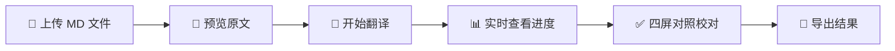

<div align="center">

# 🌐 MDtranslator

**基于大语言模型的 Markdown 文档智能翻译工具**

[](LICENSE)
[](https://python.org)
[](https://nodejs.org)
[](https://fastapi.tiangolo.com)
[](https://nextjs.org)

[功能特性](#-功能特性) •
[解决痛点](#-解决痛点) •
[快速开始](#-快速开始) •
[使用指南](#-使用指南) •
[技术架构](#-技术架构) •
[开发指南](#-开发指南)


</div>

---

## 😫 解决痛点

| 痛点 | 传统方案 | MDtranslator |
|:---:|:---:|:---:|
| **格式丢失** | 翻译后 Markdown 格式混乱，代码块/公式被破坏 | ✅ 完美保留所有格式 |
| **上下文断裂** | 整篇文档一次翻译，超长文本被截断 | ✅ 智能分块，保持语义连贯 |
| **无法对照** | 译文和原文分开，难以校对 | ✅ 四分屏实时对照 |
| **进度不透明** | 长文档翻译时只能等待 | ✅ 流式输出，实时显示进度 |
| **历史丢失** | 翻译结果需要手动保存 | ✅ 自动持久化，随时恢复 |

---

## ✨ 功能特性

<table>
<tr>
<td width="50%">

### 🔄 智能分块翻译
- 按文档结构自动分块
- 段落边界智能识别
- 上下文信息传递
- 可配置分块数量

</td>
<td width="50%">

### 📝 四分屏实时预览
- 原文源码 / 原文渲染
- 译文源码 / 译文渲染
- 面板可独立放大
- 支持 Mermaid / KaTeX

</td>
</tr>
<tr>
<td width="50%">

### 🎯 格式完美保持
- Markdown 语法完整保留
- 代码块语法高亮
- 数学公式正确渲染
- 表格/图片/链接不变形

</td>
<td width="50%">

### 💾 自动持久化
- SQLite 数据库存储
- 翻译历史一键恢复
- 设置自动同步
- 支持文档管理

</td>
</tr>
</table>

---

## 🚀 快速开始

### 环境要求

> **Python** ≥ 3.10 &nbsp;•&nbsp; **Node.js** ≥ 18 &nbsp;•&nbsp; **Conda** (推荐)

### 1️⃣ 克隆项目

```bash
git clone https://github.com/Shepherd010/MDtranslator.git
cd MDtranslator
```

### 2️⃣ 配置 API Key

```bash
cp .env.example .env
```

编辑 `.env` 文件：

```env
QWEN_API_KEY=your_api_key_here
QWEN_API_URL=https://dashscope.aliyuncs.com/compatible-mode/v1
QWEN_MODEL_NAME=qwen-flash
```

> 💡 支持阿里云通义千问 API 或任何 OpenAI 兼容接口

### 3️⃣ 安装依赖

<details>
<summary><b>后端 (Python)</b></summary>

```bash
# 创建环境
conda create -n mdtranslator python=3.11
conda activate mdtranslator

# 安装依赖
pip install -r backend/requirements.txt
```

</details>

<details>
<summary><b>前端 (Node.js)</b></summary>

```bash
cd src
yarn install  # 或 npm install
```

</details>

### 4️⃣ 启动服务

**Windows:**
```powershell
conda activate mdtranslator
.\start.ps1
```

**Linux/macOS:**
```bash
conda activate mdtranslator
bash start.sh
```

### 5️⃣ 开始使用

🌐 打开浏览器访问 **http://localhost:3000**

---

## 📖 使用指南

### 基本流程



### 界面模式

| 模式 | 触发时机 | 布局 |
|:---:|:---:|:---:|
| **二分屏** | 上传后 | 左：源码编辑器 / 右：渲染预览 |
| **四分屏** | 翻译后 | 左上：原文MD / 右上：原文预览<br>左下：译文MD / 右下：译文预览 |

### 设置选项

| 设置项 | 说明 | 默认值 |
|:---|:---|:---:|
| LLM 模型 | 使用的语言模型 | `qwen-flash` |
| 温度 | 生成随机性 (0~1) | `0.1` |
| 分块数量 | 并行翻译块数 | `3` |
| 自动保存 | 自动持久化历史 | `开启` |

---

## 🏗️ 技术架构

```
┌─────────────────────────────────────────────────────────┐
│                   Frontend (Next.js 14)                 │
│  ┌──────────┐  ┌──────────┐  ┌──────────┐  ┌────────┐   │
│  │ Editor   │  │ Preview  │  │ History  │  │Settings│   │
│  │CodeMirror│  │react-md  │  │  Modal   │  │ Modal  │   │
│  └────┬─────┘  └────┬─────┘  └────┬─────┘  └───┬────┘   │
│       └─────────────┴─────────────┴────────────┘        │
│                         Zustand                         │
└─────────────────────────┬───────────────────────────────┘
                          │ HTTP / WebSocket
┌─────────────────────────┴───────────────────────────────┐
│                   Backend (FastAPI)                     │
│  ┌──────────┐  ┌──────────┐  ┌──────────────────────┐   │
│  │Translate │  │Documents │  │      Settings        │   │
│  │   API    │  │   API    │  │        API           │   │
│  └────┬─────┘  └────┬─────┘  └──────────┬───────────┘   │
│       └─────────────┴───────────────────┘               │
│                   SQLite Storage                        │
│                         │                               │
│              LLM API (Qwen / OpenAI)                    │
└─────────────────────────────────────────────────────────┘
```

### 技术栈

| 层级 | 技术 |
|:---|:---|
| **前端框架** | Next.js 14 + React 18 + TypeScript |
| **状态管理** | Zustand |
| **代码编辑** | CodeMirror 6 |
| **Markdown** | react-markdown + remark/rehype |
| **公式渲染** | KaTeX |
| **图表渲染** | Mermaid |
| **动画效果** | Framer Motion |
| **后端框架** | FastAPI + Uvicorn |
| **数据存储** | SQLite + aiosqlite |
| **LLM 接口** | OpenAI SDK |

---

## 🛠️ 开发指南

### 项目结构

```
MDtranslator/
├── 📁 backend/                 # 后端服务
│   ├── main.py                # FastAPI 入口
│   ├── persistent_storage.py  # SQLite 存储
│   ├── markdown_utils.py      # MD 分块工具
│   ├── routers/
│   │   └── translate.py       # 翻译 API
│   └── prompts/
│       └── system_prompt.txt  # 翻译提示词
│
├── 📁 src/                     # 前端应用
│   └── src/
│       ├── app/               # Next.js 页面
│       ├── components/        # React 组件
│       ├── hooks/             # 自定义 Hooks
│       └── store/             # Zustand 状态
│
├── 📁 example/                 # 示例文档
├── 📁 doc/                     # 文档资源
├── start.ps1                  # Windows 启动脚本
├── start.sh                   # Linux 启动脚本
└── .env.example               # 环境变量模板
```

### API 接口

| 方法 | 路径 | 说明 |
|:---:|:---|:---|
| `POST` | `/api/translate` | 创建翻译任务 |
| `WS` | `/ws/translate/{doc_id}` | 翻译进度推送 |
| `GET` | `/api/documents` | 获取文档列表 |
| `GET` | `/api/documents/{id}` | 获取文档详情 |
| `DELETE` | `/api/documents/{id}` | 删除文档 |
| `GET` | `/api/settings` | 获取设置 |
| `POST` | `/api/settings` | 保存设置 |

### 自定义提示词

编辑 `backend/prompts/system_prompt.txt` 自定义翻译风格。

---

## 📋 To-Do

- [ ] 添加多语言互译支持
- [ ] 更好用的MD文本编辑器
- [ ] 秒级实时互译修改+渲染
- [ ] 工作区+选项卡+多文档翻译
- [ ] 多样化外观
- [ ] 添加本地模型支持
- [ ] 添加更多参数支持
- [ ] Docker部署
- [ ] github md链接一键翻译
- [ ] Chat-Bot支持
- [ ] 添加更多语言支持
- [ ] LaTex-HTML支持
- [ ] OCR转MD支持

---

## 📄 许可证

本项目基于 [MIT License](LICENSE) 开源。

## 🤝 贡献

欢迎提交 [Issue](https://github.com/Shepherd010/MDtranslator/issues) 和 Pull Request！

---

<div align="center">

**Made with ❤️ by [Shepherd010](https://github.com/Shepherd010)**

⭐ 如果这个项目对你有帮助，请给它一个 Star！

</div>
