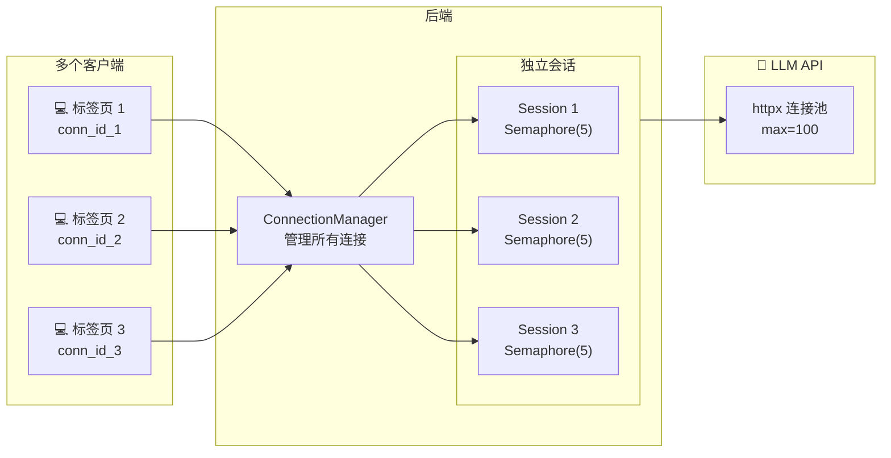
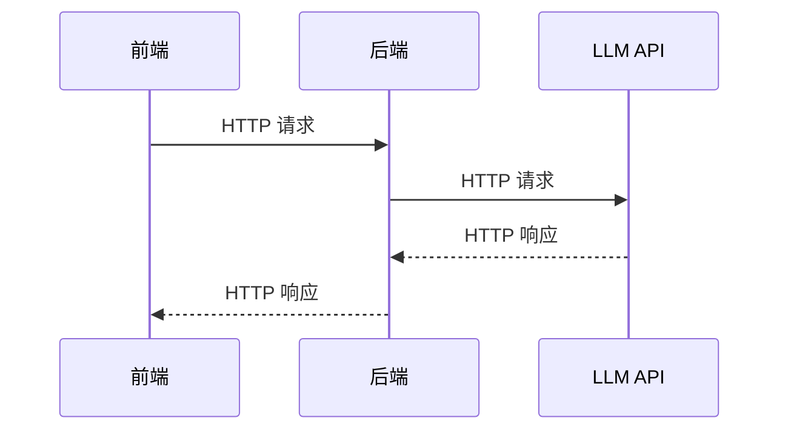
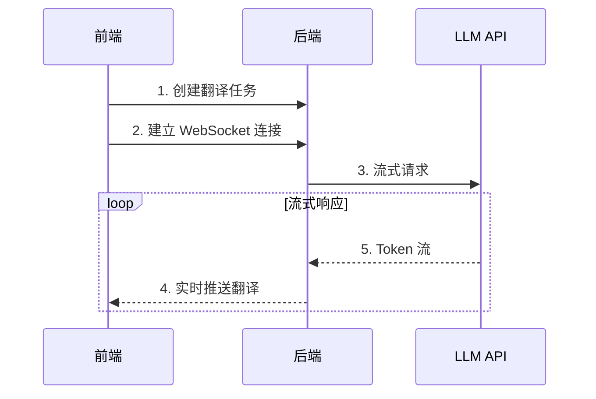
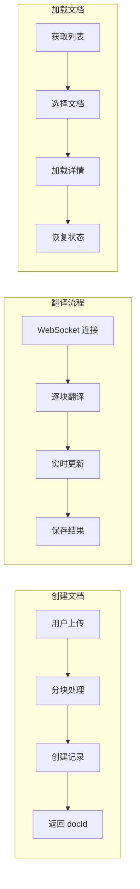

# 🏗️ 系统架构

本文档详细介绍 MDtranslator 的整体架构设计、技术选型和模块划分。

## 目录

- [架构概览](#架构概览)
- [核心特性](#核心特性)
- [技术选型](#技术选型)
- [模块划分](#模块划分)
- [通信机制](#通信机制)
- [数据存储](#数据存储)
- [设计原则](#设计原则)

---

## 核心特性

### 🌐 双向翻译支持

系统支持两种翻译方向：

| 方向 | 说明 | Prompt 文件 |
|:---|:---|:---|
| `en2zh` | 英文 → 中文 | `system_prompt_to_E.txt` |
| `zh2en` | 中文 → 英文 | `system_prompt_to_C.txt` |

用户可在前端界面一键切换翻译方向，系统会自动加载对应的 System Prompt。

### 👥 多用户并发支持

系统支持多个用户/多个浏览器标签页同时进行翻译：

- **独立会话**: 每个浏览器标签页生成唯一的 `connection_id`
- **连接管理**: `ConnectionManager` 类管理所有 WebSocket 连接
- **独立并发控制**: 每个 `TranslationSession` 拥有独立的 `Semaphore`
- **消息节流**: 50ms 发送间隔 + 每 3 个 Token 发送一次更新
- **连接池**: 共享的 `httpx.AsyncClient`，最大 100 连接



---

## 架构概览

MDtranslator 采用前后端分离架构，由 Next.js 前端和 FastAPI 后端组成。

```mermaid
flowchart TB
    subgraph Browser["🌐 用户浏览器"]
        direction TB
    end

    subgraph Frontend["Frontend (Next.js 14)"]
        direction TB
        subgraph PageLayer["页面层"]
            UploadZone[UploadZone]
            SplitLayout[SplitLayout]
            Settings[Settings]
            History[History]
        end
        subgraph ComponentLayer["组件层"]
            Editor[Editor]
            Preview[Preview]
            Modals[Modals]
            Layout[Layout]
            UI[UI]
        end
        subgraph StateLayer["状态层"]
            Zustand[Zustand Store]
            Hooks[Custom Hooks]
        end
        subgraph ServiceLayer["服务层"]
            APIRoutes[API Routes Proxy]
            WSClient[WebSocket Client]
        end
        PageLayer --> ComponentLayer
        ComponentLayer --> StateLayer
        StateLayer --> ServiceLayer
    end

    subgraph Backend["Backend (FastAPI)"]
        direction TB
        subgraph RouterLayer["路由层"]
            Translate["/api/translate"]
            Documents["/api/documents"]
            SettingsAPI["/api/settings"]
            WS["/ws/translate/{id}"]
        end
        subgraph BizLayer["服务层"]
            TranslateService[TranslateService]
            DocumentService[DocumentService]
            SettingsService[SettingsService]
        end
        subgraph ToolLayer["工具层"]
            MarkdownUtils[MarkdownUtils]
            ConnectionManager["ConnectionManager\n(多用户并发)"]
            PromptBuilder["PromptBuilder\n(双向翻译)"]
            TranslationSession["TranslationSession\n(独立并发控制)"]
        end
        subgraph StorageLayer["存储层"]
            SQLite[(PersistentStore SQLite)]
        end
        RouterLayer --> BizLayer
        BizLayer --> ToolLayer
        ToolLayer --> StorageLayer
    end

    subgraph External["External Services"]
        LLM["🤖 LLM API (Qwen / OpenAI Compatible)"]
    end

    Browser -->|HTTP / WebSocket| Frontend
    Frontend -->|HTTP / WebSocket| Backend
    Backend --> External
```



---

## 技术选型

### 前端技术栈

| 技术 | 版本 | 用途 | 选型理由 |
|:---|:---|:---|:---|
| **Next.js** | 14.x | 应用框架 | SSR/SSG、API Routes、文件路由 |
| **React** | 18.x | UI 库 | 生态丰富、Hooks 支持 |
| **TypeScript** | 5.x | 类型系统 | 类型安全、开发体验 |
| **Zustand** | 4.x | 状态管理 | 轻量、简洁、无模板代码 |
| **CodeMirror** | 6.x | 代码编辑器 | 高性能、可扩展、Markdown 支持 |
| **react-markdown** | 9.x | Markdown 渲染 | 支持插件、自定义组件 |
| **KaTeX** | 0.16.x | 数学公式 | 快速、轻量 |
| **Mermaid** | 10.x | 图表渲染 | 支持多种图表类型 |
| **Framer Motion** | 11.x | 动画 | 声明式、流畅 |
| **Tailwind CSS** | 3.x | 样式 | 原子化、快速开发 |

### 后端技术栈

| 技术 | 版本 | 用途 | 选型理由 |
|:---|:---|:---|:---|
| **FastAPI** | 0.100+ | Web 框架 | 高性能、自动文档、类型提示 |
| **Uvicorn** | 0.23+ | ASGI 服务器 | 高性能、支持 WebSocket |
| **Python** | 3.11 | 运行时 | 生态丰富、AI 支持好 |
| **aiosqlite** | 0.19+ | 异步 SQLite | 异步支持、轻量 |
| **OpenAI SDK** | 1.x | LLM 调用 | 标准接口、兼容性好 |
| **Pydantic** | 2.x | 数据验证 | FastAPI 集成、类型安全 |

---

## 模块划分

### 前端模块

```
src/src/
├── app/                    # Next.js App Router
│   ├── page.tsx           # 首页
│   ├── layout.tsx         # 根布局
│   ├── globals.css        # 全局样式
│   └── api/               # API Routes (代理)
│       ├── documents/     # 文档 API
│       ├── settings/      # 设置 API
│       ├── translate/     # 翻译 API
│       └── example/       # 示例文件 API
│
├── components/             # React 组件
│   ├── Editor.tsx         # 代码编辑器
│   ├── Preview.tsx        # Markdown 预览
│   ├── SplitLayout.tsx    # 分屏布局
│   ├── UploadZone.tsx     # 上传区域
│   ├── Mermaid.tsx        # Mermaid 图表
│   ├── layout/            # 布局组件
│   │   └── Header.tsx     # 顶部工具栏
│   ├── modals/            # 弹窗组件
│   │   ├── SettingsModal.tsx
│   │   └── HistoryModal.tsx
│   └── ui/                # 基础 UI 组件
│       └── button.tsx
│
├── hooks/                  # 自定义 Hooks
│   ├── index.ts           # 导出入口
│   ├── useTranslation.ts  # 翻译逻辑
│   ├── useDocumentHistory.ts  # 历史记录
│   └── useSettings.ts     # 设置管理
│
├── store/                  # Zustand 状态
│   └── useDocumentStore.ts
│
└── lib/                    # 工具函数
    └── utils.ts
```

### 后端模块

```
backend/
├── main.py                 # FastAPI 应用入口
├── persistent_storage.py   # SQLite 存储层
├── markdown_utils.py       # Markdown 处理工具
│
├── routers/                # API 路由
│   └── translate.py       # 翻译相关 API
│
├── prompts/                # 提示词模板
│   └── system_prompt.txt  # 系统提示词
│
├── data/                   # 数据目录
│   └── mdtranslator.db    # SQLite 数据库
│
└── requirements.txt        # Python 依赖
```

---

## 通信机制

### HTTP 通信

用于普通的请求-响应模式：



### WebSocket 通信

用于翻译过程的实时流式输出：



### 消息格式

**WebSocket 消息类型：**

```typescript
// 分块更新消息
{
  type: "chunk_update",
  chunkIndex: 0,
  data: {
    status: "processing" | "completed" | "error",
    translatedText: "翻译内容..."
  }
}

// 翻译完成消息
{
  type: "translation_complete",
  docId: "uuid-xxx"
}
```

---

## 数据存储

### 数据库设计

使用 SQLite 存储文档和设置，数据库文件位于 `backend/data/mdtranslator.db`。

#### documents 表

| 字段 | 类型 | 说明 |
|:---|:---|:---|
| id | TEXT | 主键，UUID |
| title | TEXT | 文档标题 |
| original_content | TEXT | 原始内容 |
| translated_content | TEXT | 翻译内容 |
| chunks_data | TEXT | 分块数据 (JSON) |
| status | TEXT | 状态 |
| created_at | TEXT | 创建时间 |
| updated_at | TEXT | 更新时间 |

#### settings 表

| 字段 | 类型 | 说明 |
|:---|:---|:---|
| key | TEXT | 主键，设置键 |
| value | TEXT | 设置值 (JSON) |

### 数据流



---

## 设计原则

### 1. 关注点分离

- **前端**：负责 UI 展示、用户交互、状态管理
- **后端**：负责业务逻辑、数据存储、外部服务调用
- **通信层**：HTTP 用于普通请求，WebSocket 用于实时推送

### 2. 模块化设计

- 组件按功能拆分，职责单一
- Hooks 封装可复用逻辑
- 服务层抽象外部依赖

### 3. 类型安全

- 前端使用 TypeScript
- 后端使用 Pydantic 模型
- API 接口类型定义明确

### 4. 异步优先

- 后端全面使用 async/await
- 前端使用 React 18 并发特性
- 数据库操作使用 aiosqlite

### 5. 可扩展性

- 支持多种 LLM 提供商
- 提示词模板可自定义
- 存储层可替换

---

## 下一步

- 💻 [前端开发](./03-前端开发.md) - 深入前端架构
- 🔧 [后端开发](./04-后端开发.md) - 深入后端架构
- 🔄 [数据流设计](./05-数据流设计.md) - 了解数据流转
