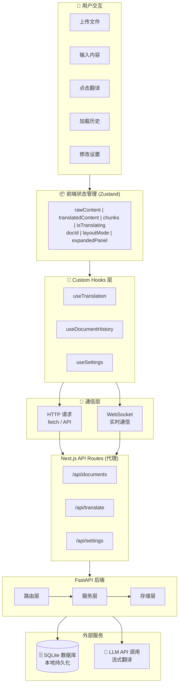
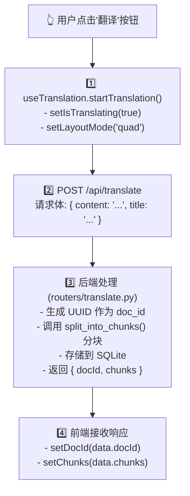
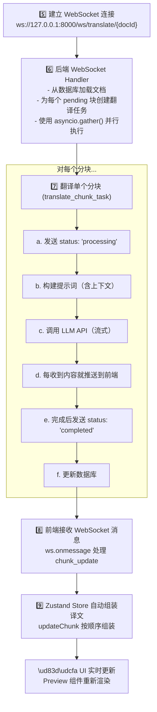
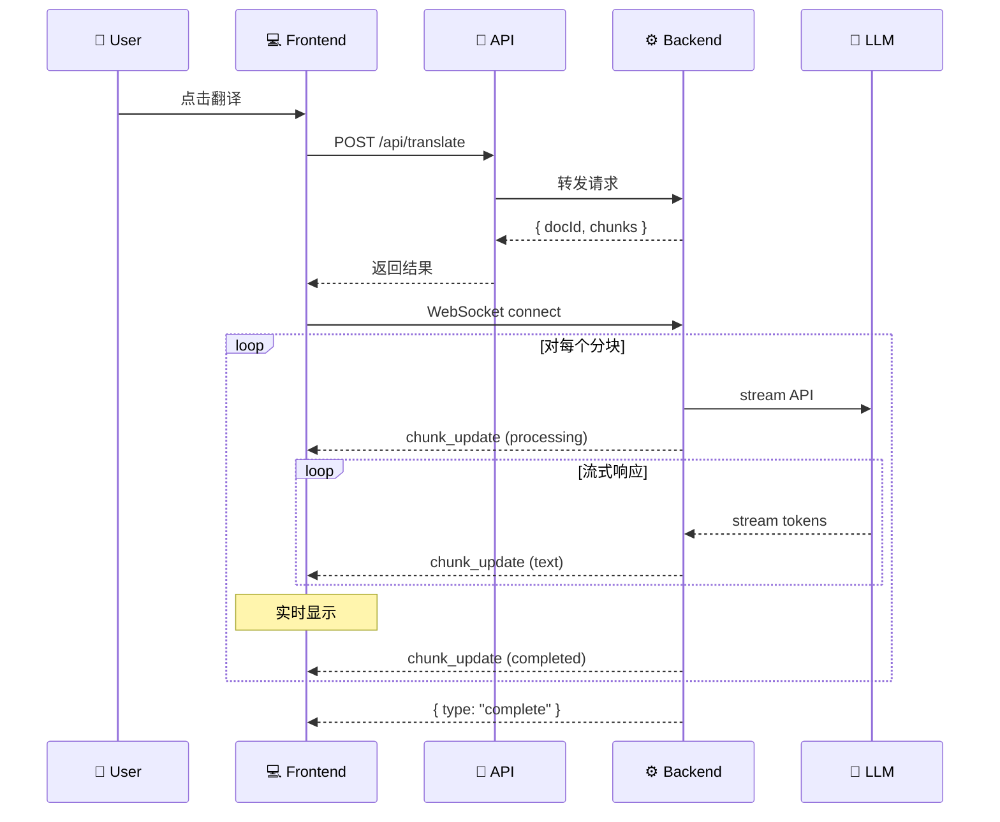
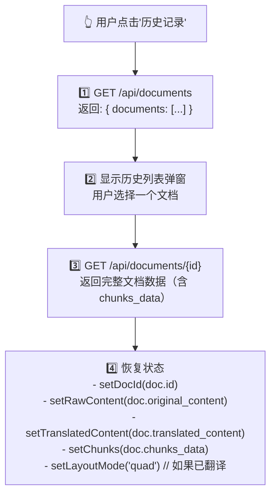
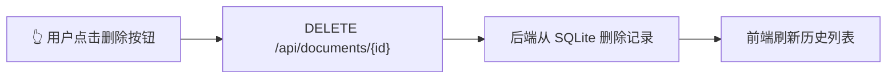
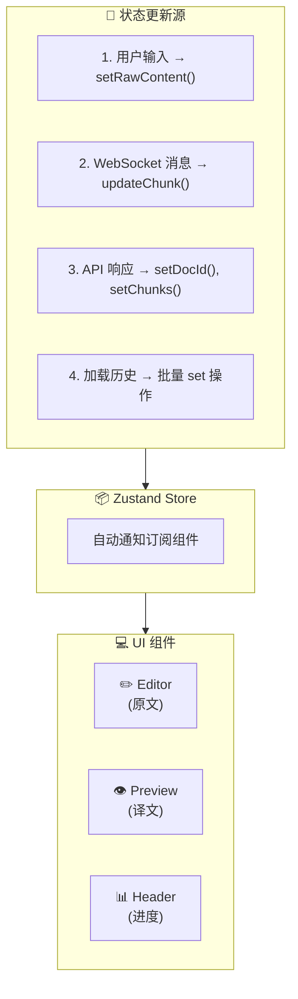
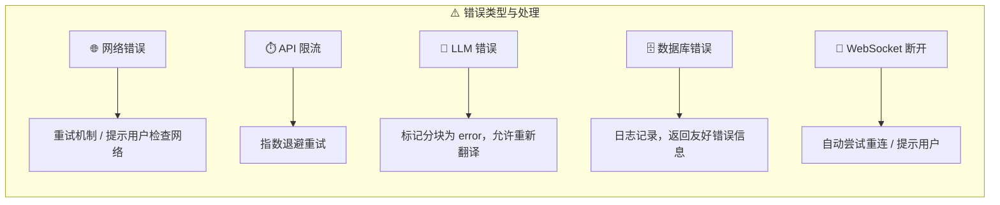

# 🔄 数据流设计

本文档详细介绍 MDtranslator 中数据的流转过程，包括 HTTP 请求、WebSocket 通信和状态同步。

## 目录

- [整体数据流](#整体数据流)
- [翻译流程](#翻译流程)
- [文档管理流程](#文档管理流程)
- [状态同步机制](#状态同步机制)
- [错误处理](#错误处理)

---

## 整体数据流



---

## 翻译流程

翻译是最核心的功能，涉及多个步骤和组件协作。

### 1. 创建翻译任务



### 2. WebSocket 实时翻译



### 时序图



---

## 文档管理流程

### 加载历史文档



### 删除文档



---

## 状态同步机制

### Zustand Store 结构

```typescript
interface DocumentState {
  // 文档数据
  docId: string | null;
  rawContent: string;
  translatedContent: string;
  chunks: TranslationChunk[];
  
  // UI 状态
  isTranslating: boolean;
  layoutMode: 'split' | 'quad';
  expandedPanel: '...' | 'none';
}
```

### 状态更新流向



### 分块更新与译文组装

```typescript
// 核心逻辑：updateChunk
updateChunk: (index, data) => set((state) => {
  const newChunks = [...state.chunks];
  
  // 1. 找到对应分块
  const chunkIdx = newChunks.findIndex(c => c.chunkIndex === index);
  if (chunkIdx !== -1) {
    newChunks[chunkIdx] = { ...newChunks[chunkIdx], ...data };
  }
  
  // 2. 按顺序排列并组装
  const assembled = newChunks
    .sort((a, b) => a.chunkIndex - b.chunkIndex)
    .map(c => c.translatedText || '')
    .join('');  // 无分隔符，块内已含换行

  return { 
    chunks: newChunks, 
    translatedContent: assembled 
  };
})
```

**关键点：**

| 要点 | 说明 |
|:---|:---|
| 原子更新 | 每次只更新一个分块 |
| 自动组装 | 更新后自动重新组装完整译文 |
| 顺序保证 | 按 `chunkIndex` 排序确保顺序正确 |
| 实时渲染 | React 自动检测变化并重新渲染 |

---

## 错误处理

### 前端错误处理

```typescript
// useTranslation.ts
const startTranslation = useCallback(async () => {
  try {
    const response = await fetch('/api/translate', { ... });
    if (!response.ok) throw new Error('Translation failed');
    
    // WebSocket 错误处理
    ws.onerror = () => setIsTranslating(false);
    ws.onclose = () => setIsTranslating(false);
    
  } catch (e) {
    console.error(e);
    setIsTranslating(false);
  }
}, []);
```

### 后端错误处理

```python
# routers/translate.py
async def translate_chunk_task(...):
    try:
        # 翻译逻辑...
    except Exception as e:
        print(f"Error translating chunk {chunk_index}: {e}")
        
        # 通知前端错误状态
        await manager.send_message(doc_id, {
            "type": "chunk_update",
            "chunkIndex": chunk_index,
            "data": {"status": "error"}
        })
        
        # 更新数据库状态
        await document_store.update_chunk(doc_id, chunk_index, "", "error")
```

### 错误恢复策略



---

## 下一步

- 📡 [API 参考](./06-API参考.md) - 完整 API 接口文档
- 🛠️ [二次开发](./07-二次开发.md) - 功能扩展指南
- 🚀 [部署指南](./08-部署指南.md) - 生产环境部署
