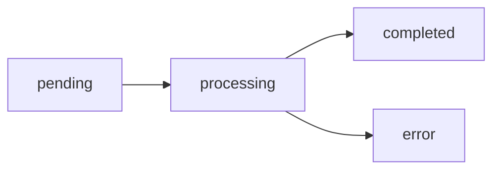

# 📡 API 参考

本文档提供 MDtranslator 所有 API 接口的完整参考文档。

## 目录

- [概述](#概述)
- [翻译 API](#翻译-api)
- [文档 API](#文档-api)
- [设置 API](#设置-api)
- [WebSocket API](#websocket-api)
- [示例 API](#示例-api)
- [错误处理](#错误处理)

---

## 概述

### 基础信息

| 项目 | 值 |
|:---|:---|
| 后端地址 | `http://127.0.0.1:8000` |
| 前端地址 | `http://127.0.0.1:3000` |
| WebSocket | `ws://127.0.0.1:8000/ws/translate/{doc_id}` |
| 内容类型 | `application/json` |

### API 文档

后端启动后，可访问自动生成的 API 文档：

- **Swagger UI**: http://127.0.0.1:8000/docs
- **ReDoc**: http://127.0.0.1:8000/redoc

---

## 翻译 API

### 创建翻译任务

创建新的翻译任务，将内容分块并存储。支持**双向翻译**（英文↔中文）。

**请求**

```http
POST /api/translate
Content-Type: application/json
```

**请求体**

```json
{
  "content": "# Hello World\n\nThis is a markdown document.",
  "title": "My Document",
  "direction": "en2zh"
}
```

| 字段 | 类型 | 必填 | 说明 |
|:---|:---|:---|:---|
| `content` | string | ✅ | Markdown 内容 |
| `title` | string | ❌ | 文档标题（可选） |
| `direction` | string | ❌ | 翻译方向：`en2zh`（英→中，默认）或 `zh2en`（中→英） |

**响应**

```json
{
  "docId": "550e8400-e29b-41d4-a716-446655440000",
  "chunks": [
    {
      "chunk_index": 0,
      "raw_text": "# Hello World\n\n",
      "translated_text": null,
      "status": "pending",
      "start_line": 0,
      "end_line": 2
    },
    {
      "chunk_index": 1,
      "raw_text": "This is a markdown document.",
      "translated_text": null,
      "status": "pending",
      "start_line": 2,
      "end_line": 3
    }
  ]
}
```

| 字段 | 类型 | 说明 |
|:---|:---|:---|
| `docId` | string | 文档 UUID |
| `chunks` | array | 分块数组 |
| `chunks[].chunk_index` | number | 分块索引 |
| `chunks[].raw_text` | string | 原始文本 |
| `chunks[].translated_text` | string\|null | 译文 |
| `chunks[].status` | string | 状态：pending/processing/completed/error |

---

## 文档 API

### 获取文档列表

获取所有已保存的文档摘要。

**请求**

```http
GET /api/documents
```

**响应**

```json
{
  "documents": [
    {
      "id": "550e8400-e29b-41d4-a716-446655440000",
      "title": "My Document",
      "status": "completed",
      "created_at": "2024-01-15T10:30:00",
      "updated_at": "2024-01-15T10:35:00",
      "is_translated": true
    }
  ]
}
```

| 字段 | 类型 | 说明 |
|:---|:---|:---|
| `documents` | array | 文档数组 |
| `id` | string | 文档 ID |
| `title` | string | 标题 |
| `status` | string | 状态 |
| `created_at` | string | 创建时间 (ISO 8601) |
| `updated_at` | string | 更新时间 (ISO 8601) |
| `is_translated` | boolean | 是否已翻译 |

---

### 获取单个文档

获取文档的完整内容，包括分块数据。

**请求**

```http
GET /api/documents/{doc_id}
```

**路径参数**

| 参数 | 类型 | 说明 |
|:---|:---|:---|
| `doc_id` | string | 文档 UUID |

**响应**

```json
{
  "id": "550e8400-e29b-41d4-a716-446655440000",
  "title": "My Document",
  "original_content": "# Hello World\n\nThis is a markdown document.",
  "translated_content": "# 你好世界\n\n这是一个 markdown 文档。",
  "chunks_data": [
    {
      "chunk_index": 0,
      "raw_text": "# Hello World\n\n",
      "translated_text": "# 你好世界\n\n",
      "status": "completed"
    }
  ],
  "status": "completed",
  "created_at": "2024-01-15T10:30:00",
  "updated_at": "2024-01-15T10:35:00",
  "is_translated": true
}
```

**错误响应**

```json
{
  "detail": "Document not found"
}
```

---

### 删除文档

删除指定文档。

**请求**

```http
DELETE /api/documents/{doc_id}
```

**路径参数**

| 参数 | 类型 | 说明 |
|:---|:---|:---|
| `doc_id` | string | 文档 UUID |

**响应**

```json
{
  "success": true
}
```

**错误响应**

```json
{
  "detail": "Document not found"
}
```

---

## 设置 API

### 获取设置

获取当前应用设置。

**请求**

```http
GET /api/settings
```

**响应**

```json
{
  "llm_provider": "qwen",
  "llm_model": "qwen-flash",
  "temperature": 0.1,
  "num_chunks": 3,
  "auto_save": true
}
```

| 字段 | 类型 | 默认值 | 说明 |
|:---|:---|:---|:---|
| `llm_provider` | string | "qwen" | LLM 提供商 |
| `llm_model` | string | "qwen-flash" | 模型名称 |
| `temperature` | number | 0.1 | 温度参数 |
| `num_chunks` | number | 3 | 分块数量 |
| `auto_save` | boolean | true | 是否自动保存 |

---

### 保存设置

保存应用设置。

**请求**

```http
POST /api/settings
Content-Type: application/json
```

**请求体**

```json
{
  "settings": {
    "llm_model": "qwen-turbo",
    "num_chunks": 5,
    "temperature": 0.2
  }
}
```

**响应**

```json
{
  "success": true
}
```

---

## WebSocket API

### 翻译 WebSocket

建立 WebSocket 连接以接收实时翻译结果。支持**多用户/多标签页并发**连接。

**连接**

```
ws://127.0.0.1:8000/ws/translate/{doc_id}?conn_id={connection_id}
```

**参数**

| 参数 | 类型 | 必填 | 说明 |
|:---|:---|:---|:---|
| `doc_id` | string | ✅ | 通过 POST /api/translate 获取的文档 ID |
| `conn_id` | string | ✅ | 连接唯一标识，用于区分不同的浏览器标签页 |

**多用户并发说明**

- 每个浏览器标签页应生成唯一的 `conn_id`
- 服务端为每个连接维护独立的翻译会话
- 多个用户同时翻译互不干扰
- 建议 `conn_id` 格式：`conn_{timestamp}_{random}`

**示例连接 URL**

```
ws://127.0.0.1:8000/ws/translate/550e8400-e29b-41d4-a716-446655440000?conn_id=conn_1701234567890_abc123def
```

---

### 消息类型

#### chunk_update

分块翻译更新消息。

```json
{
  "type": "chunk_update",
  "chunkIndex": 0,
  "data": {
    "status": "processing",
    "translatedText": ""
  }
}
```

状态流转：



| 字段 | 类型 | 说明 |
|:---|:---|:---|
| `type` | string | 消息类型，固定为 "chunk_update" |
| `chunkIndex` | number | 分块索引 |
| `data.status` | string | 状态：processing/completed/error |
| `data.translatedText` | string | 当前已翻译的文本（流式累积） |

**消息节流**

为了优化性能，服务端对消息发送进行了节流控制：
- 最小发送间隔：50ms
- Token 批量发送：每 3 个 Token 发送一次更新
- 状态变更（processing/completed/error）强制立即发送

#### complete

翻译完成消息。

```json
{
  "type": "complete"
}
```

---

### WebSocket 使用示例

```javascript
// 1. 创建翻译任务
const response = await fetch('/api/translate', {
  method: 'POST',
  headers: { 'Content-Type': 'application/json' },
  body: JSON.stringify({ content: markdownContent })
});
const { docId, chunks } = await response.json();

// 2. 建立 WebSocket 连接
const ws = new WebSocket(`ws://127.0.0.1:8000/ws/translate/${docId}`);

// 3. 处理消息
ws.onmessage = (event) => {
  const msg = JSON.parse(event.data);
  
  switch (msg.type) {
    case 'chunk_update':
      console.log(`Chunk ${msg.chunkIndex}: ${msg.data.status}`);
      if (msg.data.translatedText) {
        // 更新 UI 显示翻译内容
        updateChunkDisplay(msg.chunkIndex, msg.data.translatedText);
      }
      break;
      
    case 'complete':
      console.log('Translation complete!');
      ws.close();
      break;
  }
};

ws.onerror = (error) => {
  console.error('WebSocket error:', error);
};

ws.onclose = () => {
  console.log('WebSocket closed');
};
```

---

## 示例 API

### 加载示例文档

加载项目中的示例 README 文件。

**请求**

```http
GET /api/example
```

**响应**

```json
{
  "content": "# Example README\n\n\n\n...",
  "filename": "README.md"
}
```

**说明**

- 示例文件位于 `example/README.md`
- 图片路径会自动转换：`./assets/` → `/api/example/assets/`

---

### 获取示例资源

获取示例目录中的静态资源文件。

**请求**

```http
GET /api/example/assets/{path}
```

**路径参数**

| 参数 | 类型 | 说明 |
|:---|:---|:---|
| `path` | string | 资源相对路径，如 `logo.png` 或 `images/screenshot.png` |

**响应**

返回文件内容，Content-Type 根据文件类型自动设置。

---

## 错误处理

### HTTP 错误码

| 状态码 | 说明 |
|:---|:---|
| 200 | 成功 |
| 400 | 请求参数错误 |
| 404 | 资源不存在 |
| 500 | 服务器内部错误 |

### 错误响应格式

```json
{
  "detail": "Error message here"
}
```

### WebSocket 关闭码

| 关闭码 | 说明 |
|:---|:---|
| 1000 | 正常关闭 |
| 4004 | 文档不存在 |

---

## TypeScript 类型定义

```typescript
// 翻译请求
interface TranslateRequest {
  content: string;
  title?: string;
}

// 翻译响应
interface TranslateResponse {
  docId: string;
  chunks: Chunk[];
}

// 分块
interface Chunk {
  chunk_index: number;
  raw_text: string;
  translated_text: string | null;
  status: 'pending' | 'processing' | 'completed' | 'error';
  start_line?: number;
  end_line?: number;
}

// 文档摘要
interface DocumentSummary {
  id: string;
  title: string;
  status: string;
  created_at: string;
  updated_at: string;
  is_translated: boolean;
}

// 完整文档
interface Document extends DocumentSummary {
  original_content: string;
  translated_content: string;
  chunks_data: Chunk[];
}

// 设置
interface Settings {
  llm_provider: string;
  llm_model: string;
  temperature: number;
  num_chunks: number;
  auto_save: boolean;
}

// WebSocket 消息
type WSMessage = 
  | { type: 'chunk_update'; chunkIndex: number; data: { status: string; translatedText: string } }
  | { type: 'complete' };
```

---

## 下一步

- 🛠️ [二次开发](./07-二次开发.md) - 扩展功能指南
- 🚀 [部署指南](./08-部署指南.md) - 生产环境部署
