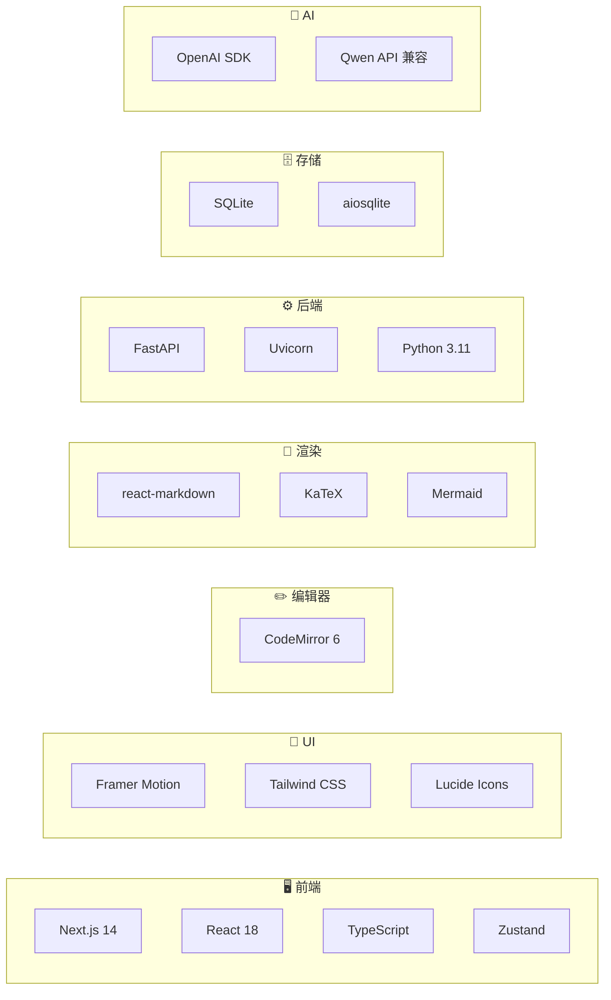

# 📚 MDtranslator 开发文档

欢迎阅读 MDtranslator 开发文档！本文档旨在帮助开发者快速了解项目架构、上手开发和进行二次开发。

## ✨ 核心特性

| 特性 | 说明 |
|:---|:---|
| 🌐 **双向翻译** | 支持英文→中文和中文→英文，一键切换 |
| 👥 **多用户并发** | 每个浏览器标签页独立会话，多人同时使用不冲突 |
| 🚀 **并行加速** | 智能分块 + 多线程并发翻译，速度提升 500%+ |
| 📝 **AST 格式保护** | 完美保留 KaTeX 公式、Mermaid 图表、代码块 |
| 💾 **自动持久化** | SQLite 存储，支持历史记录回溯 |

## 📖 文档目录

| 文档 | 说明 | 适合人群 |
|:---|:---|:---|
| [快速入门](./01-快速入门.md) | 环境搭建、项目运行、基本使用 | 所有开发者 |
| [系统架构](./02-系统架构.md) | 整体架构设计、技术选型、模块划分 | 架构师、全栈开发者 |
| [前端开发](./03-前端开发.md) | Next.js 应用、组件设计、状态管理 | 前端开发者 |
| [后端开发](./04-后端开发.md) | FastAPI 服务、API 设计、数据存储 | 后端开发者 |
| [数据流设计](./05-数据流设计.md) | 请求流程、WebSocket 通信、状态同步 | 全栈开发者 |
| [API 参考](./06-API参考.md) | 完整 API 接口文档 | 所有开发者 |
| [二次开发](./07-二次开发.md) | 扩展指南、自定义开发、插件开发 | 高级开发者 |
| [部署指南](./08-部署指南.md) | 生产部署、Docker、CI/CD | 运维工程师 |

## 🗺️ 学习路线

### 初学者路线
```
快速入门 → 系统架构 → 数据流设计 → API 参考
```

### 前端开发路线
```
快速入门 → 前端开发 → 数据流设计 → 二次开发
```

### 后端开发路线
```
快速入门 → 后端开发 → API 参考 → 二次开发
```

### 全栈开发路线
```
快速入门 → 系统架构 → 前端开发 → 后端开发 → 数据流设计 → 二次开发
```

## 🔧 技术栈概览



## 📁 项目结构

```
MDtranslator/
├── 📁 backend/          # Python 后端
├── 📁 src/              # Next.js 前端
├── 📁 doc/              # 开发文档 (当前目录)
├── 📁 example/          # 示例文件
├── .env.example         # 环境变量模板
├── start.ps1            # Windows 启动脚本
├── start.sh             # Linux 启动脚本
└── README.md            # 项目说明
```

## 💬 获取帮助

- 📖 阅读本系列文档
- 🐛 提交 [Issue](https://github.com/Shepherd010/MDtranslator/issues)
- 💡 参与 [讨论](https://github.com/Shepherd010/MDtranslator/discussions)

---

> 文档持续更新中，欢迎贡献！
